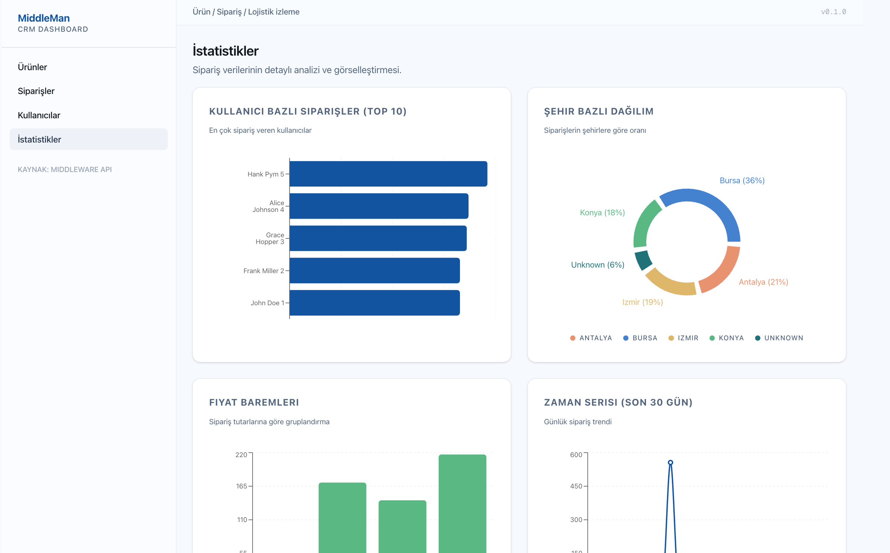
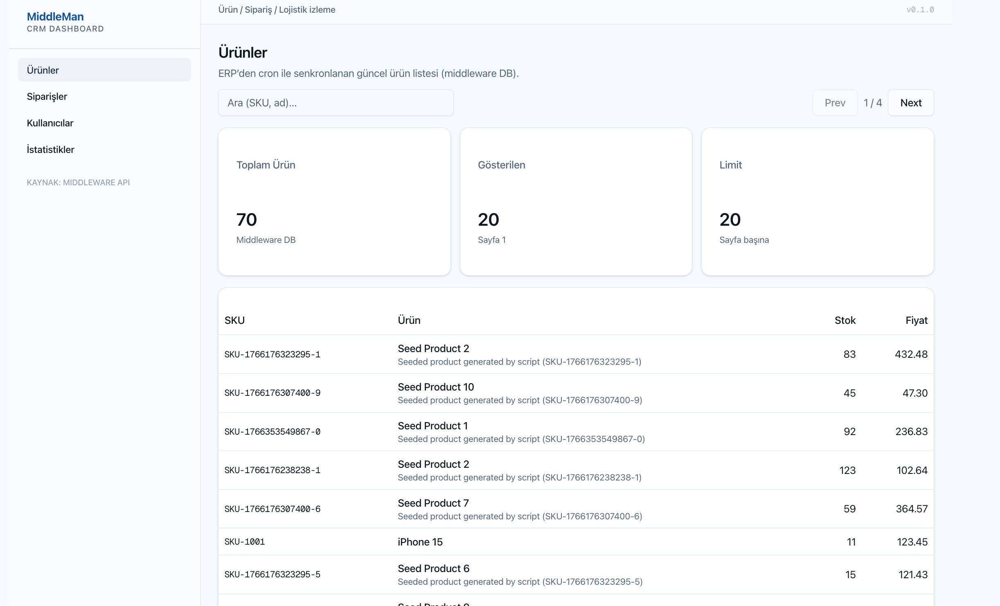
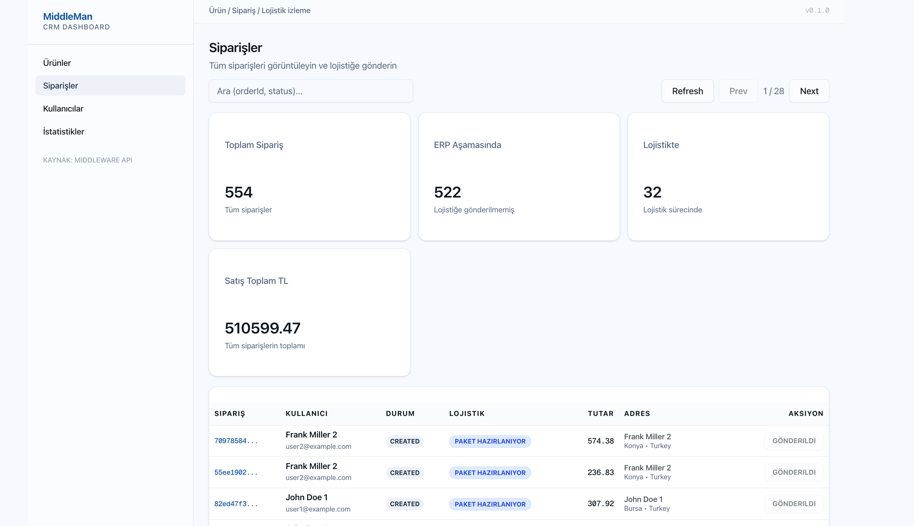
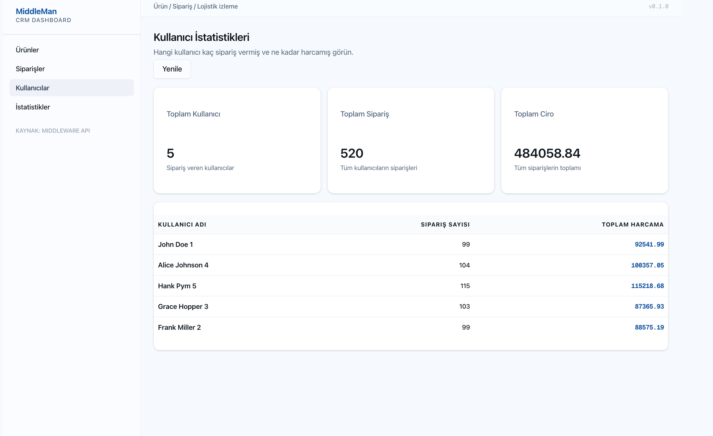
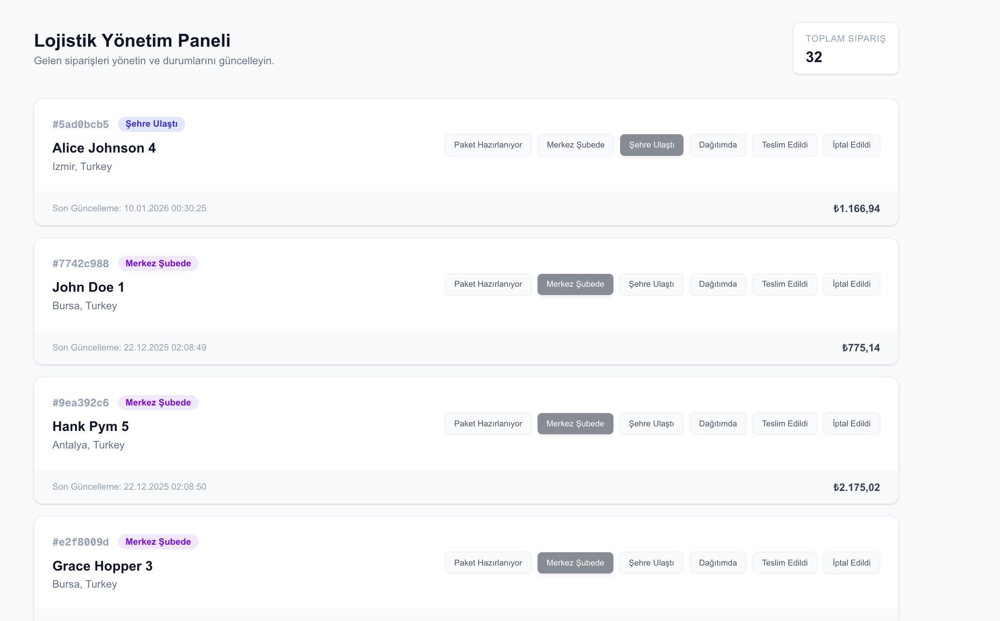

# MiddleMan - Product & Order Management Middleware

MiddleMan is a distributed middleware ecosystem designed to synchronize and manage products and orders between a **Company ERP**, a central **Middleware**, and a **Logistics** system. It provides real-time data flow, automated background synchronization, and a sleek modern dashboard for monitoring operations.

---

## 🏗️ System Architecture

The project is built as a microservices-inspired ecosystem, leveraging asynchronous messaging and caching for high availability and performance.

1.  **Company ERP**: The source of truth for products, users, and orders.
2.  **Middleware (Core)**: The central orchestration layer that manages data synchronization, analytics, and business logic.
3.  **Logistics System**: Handles order fulfillment and status updates, receiving data from the Middleware.


*Figure 1: Middleware Dashboard Analytics & Overview*

---

## ✨ Key Features

-   **🔄 Real-time Synchronization**: Uses RabbitMQ for event-driven updates between decoupled systems.
-   **📊 Operations Dashboard**: Modern UI with charts and stats for tracking orders and product performance.
-   **🛠️ Robust Data Sync**: Cron-based background workers to ensure data consistency.
-   **📦 Media Management**: Integrated with MinIO for high-performance object storage.
-   **🚦 Scalable Infra**: Fully containerized with Docker, featuring multi-database (PostgreSQL) and caching (Redis) layers.

---

## 🖼️ Visual Showcase

### Middleware Management
Manage products, orders, and users through a centralized interface.

````carousel

<!-- slide -->

<!-- slide -->

````

### Logistics Integration
Track orders sent to logistics and manage their status updates.


*Figure 2: Logistics Operations Dashboard*

---

## 🛠️ Technology Stack

| Layer | Technologies |
| :--- | :--- |
| **Backend** | **NestJS 11**, TypeScript, TypeORM, RxJS, Multer |
| **Frontend** | **Next.js 16 (App Router)**, React 19, Tailwind CSS 4, Radix UI, Recharts |
| **Databases** | **PostgreSQL 15** (Multiple instances), **Redis 7** (Caching & Sidekiq-like jobs) |
| **Messaging** | **RabbitMQ 3** (Event-driven architecture) |
| **Storage** | **MinIO** (S3-compatible object storage) |
| **DevOps** | **Docker**, Docker Compose, Pino Logging |

---

## 🚀 Getting Started

### Prerequisites
- Docker & Docker Compose

### Fast Launch
1.  Clone the repository.
2.  Run the entire ecosystem with a single command:
    ```bash
    docker compose up --build -d
    ```

### Access Ports
- **Middleware Web**: [http://localhost:3003](http://localhost:3003)
- **Logistics Web**: [http://localhost:3005](http://localhost:3005)
- **Middleware API (Swagger)**: [http://localhost:3002/api/docs](http://localhost:3002/api/docs)
- **RabbitMQ Management**: [http://localhost:15672](http://localhost:15672) (guest/guest)
- **MinIO Console**: [http://localhost:9001](http://localhost:9001) (minioadmin/minioadmin)

---

## 📂 Project Structure

```text
├── company-erp      # NestJS ERP Service (Source of Truth)
├── middleware       # Central Middleware
│   ├── api          # NestJS Core API (Redis, RabbitMQ, DB)
│   └── web          # Next.js Dashboard (React 19, Tailwind 4)
├── logistics        # Logistics System
│   ├── api          # NestJS Logistics Service
│   └── web          # Next.js Logistics Dashboard
├── readme           # Project Media & Assets
└── docker-compose.yml # Full Stack Orchestration
```

---
*Developed with ❤️ as a robust middleware solution.*
